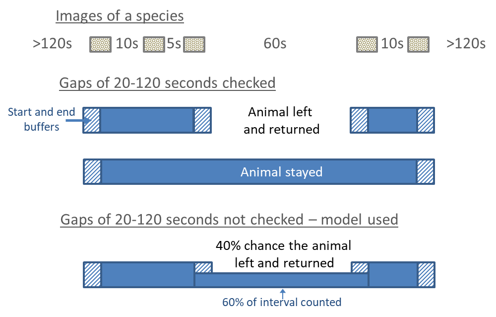

# Estimating Density using TIFC

This chapter describes how the Time In Front of Camera (TIFC) method is used to calculate animal density with images collected from remote cameras. 

This method is also documented in [Becker et al (2022)](https://esajournals.onlinelibrary.wiley.com/doi/full/10.1002/ecs2.4005).

```{r setup, include=FALSE}

# Attach packages for the chapter
library(abmi.themes)
add_abmi_fonts()

```

## Overview

### Simple Explanation

Density is the number of objects (trees, animals, etc.) per unit area. If a 100-m$^2$ plot contains one tree, the density is 1 tree/100-m$^2$, or 10,000 trees per km$^2$ ( Figure \@ref(fig:density)).  Similarly, if a camera has a field-of-view of 100-m$^2$ and there is always one animal in the field-of-view for the whole time that the camera is operating, the density of that species is 1 animal per 100-m$^2$, or 10,000 animals per km$^2$. It doesn’t matter if the animal is moving around within the field-of-view, as long as it stays in the field-of-view for the whole time. On the other hand, if that camera only has an animal in the field-of-view 1/10,000 of the time that it is operating, there is 1/10,000 animal per 100-m$^2$, or 1 animal per km-$^2$.  If the camera has two animals together for 1/10,000 of the time, this gives 2/10,000 animals per 100-m$^2$, or 2 animals per km-$^2$. This is how we use cameras to calculate density.

For a given density of animals, this simple measure is independent of home range sizes or movement rates. If home ranges were twice as big, they would have to overlap twice as much to maintain the same density. Therefore, an individual would be in a particular camera’s field-of-view half as often (because its home range is bigger – it has more other places to be), but there would be twice as many individuals at that camera. If movement rates were twice as fast, an individual would pass by the camera twice as often, but would spend half as much time in the field-of-view (because it is moving faster). For the simple example above, there would be two visits to the camera each occupying 1/20,000 of the time the camera is operating, rather than one visit for 1/10,000 of the time.  The other way of putting this is that only the total animal-time in the field-of-view matters, whether that comes from one long visit by one individual, several short visits by one individual, or several short visits each by a different individual. In all those cases, the density is the same; it is only the home range size and overlap and/or movement rates that are changing.

Two features of cameras require us to do some additional data processing to use this simple density measure: 

  1. **Cameras do not survey fixed areas, unlike quadrats**. The probability of an animal triggering the camera decreases with distance. We therefore have to estimate an *effective detection distance* (EDD) for the cameras, as is done for unlimited-distance point counts for birds or unlimited distance transect surveys. This effective distance can vary for different species, habitat types and time of year. 
  
  2. **Cameras take a series of images at discrete intervals, rather than providing a continuous record of how long an animal is in the field-of-view**. The discrete intervals need to be converted to a continuous measure to show how long the animal was in the field-of-view, accounting for the possibility that a moderately long interval between images might be from an animal present but not moving much, and therefore not triggering the camera, versus an animal that left the field-of-view and returned.

### Assumptions

There are a number of strong assumptions involved in using this measure to estimate density of a species. A couple big assumptions are: 

  + The cameras are a random or otherwise representative sample of the area. The density estimate applies to the field-of-view of the cameras. To make inferences about a larger region, the cameras need to be surveying a random or representative (e.g., systematic, systematic-random, random stratified) sample of the larger region. In particular, if cameras are intentionally placed in areas where species are more common, such as game trails, then the density estimate only applies to those places, not to a larger region.  
  
  + Animals are not attracted to or repelled by the cameras (or posts used to deploy the cameras, etc).  That also means that they do not spend more or less time in front of the camera because of the presence of the camera. The effect of lures or other attractants needs to be explicitly measured and accounted for. 
  
There are additional assumptions involved in the procedures to estimate effective detection distance, including an assumption that all animals within a certain distance of the camera are detected, and in converting the discrete images into time in field-of-view. These assumptions are discussed below. Because the world is complicated, assumptions are never met perfectly. The important thing is to consider – and, ideally, design auxiliary tests to measure – is whether the violations are serious enough to impact the answer to whatever question(s) the cameras are being used to answer. In many cases, absolute density estimates may not be accurate, but the results can still serve as a useable index of relative density, if assumptions are violated about equally in whatever units are being compared (habitat types, experimental treatments, years for long-term trend, etc).

A final consideration is the sampling distribution of density estimates. Because individual cameras sample tiny areas compared to the home ranges of the species they survey, the resulting sampling distribution can be horrendous – the majority of cameras never detect the species at all (density = 0), a few cameras record the species passing by once or twice for brief periods (low densities), and a very few number of cameras record long durations as the animals forage, rest, or play in front of the camera, or revisit a favourite spot repeatedly (very high densities). Longer duration camera deployments can help smooth out some of that extreme variation, but ultimately large numbers of cameras are required for precise estimates. Appropriate questions, rigorous study designs, and modest expectations are required for camera-based studies.

## Probabilistic gaps

From a pilot study, we determined that if there is a gap of less than 20 seconds between images of the same species at a camera, the animal is almost always still in the view (no evidence of it walking out and returning). Missing the odd time when it leaves the view for less than 20 seconds has little effect on estimates of the total time it is in the field-of-view. At the other end, if there is a gap of >120 seconds between images of the same species, this almost always represented animals leaving and then returning (i.e., the animal is seen walking out of the field-of-view, then walking back in). Gaps of 20-120 seconds are uncertain. These relatively long periods when the animal could be in the field-of-view or not are important when estimating the total duration animals are in the field-of-view, and thus density.

Using images from the 2015 ABMI Ecosystem Health project, we checked each 20-120 second gap in series’ of native mammals for evidence of the animal leaving and returning. We supplemented the 2015 data for less common species using data from 2016 and 2017. We looked at several images on either side of gaps of 20-120 seconds. In each sequence, the animal was designated as having left the field-of-view during the 20-120 second gap if there was clear evidence of it walking out of the field-of-view and then returning (or a different individual entering the field-of-view). If the animal stayed in one location within the field-of-view, or sequential images showed the animal in disconnected places (as often happens with smaller animals), the animal was assumed to have stayed.

Through this tagging procedure, we obtained the following training data to estimate the probability of an animal leaving during a gaps between 20 and 120 seconds between images. The `diff_time` variable refers to the number of seconds between images and the `left` variable refers to whether or not the individual left the camera field-of-view and returned ('Yes') or showed in the field-of-view for the duration of the gap ('No').  

```{r, eval=TRUE, echo=FALSE, warning=FALSE, message=FALSE}

raw_gap_data <- read_csv(paste0(g_drive, "data/processed/probabilistic-gaps/gap-leave-prob_raw-data_2021-10-05.csv")) |>
  mutate(left = ifelse(left == "1", "Yes", "No")) |>
  filter(!species_common_name == "Songbird") |>
  group_by(species_common_name) |>
  add_count() |>
  ungroup() |>
  mutate(rank = dense_rank(desc(n))) |>
  filter(rank < 13) |>
  mutate(species_common_name = fct_reorder(species_common_name, rank)) |>
  select(1, 3, 4)

```

```{r, eval=TRUE, echo=TRUE, warning=FALSE, message=FALSE}

head(raw_gap_data, 10)

```

Using White-tailed Deer as an example, we can visualize this data in Figure \@ref(fig:wtd). In general, observations where the animal stayed in the field of view are more closely clustered around the 20 second mark, and observations where the animal left the field of view are more evenly spread across the range of gap lengths.

```{r wtd, eval=TRUE, echo=FALSE, warning=FALSE, message=FALSE, fig.showtext=TRUE, fig.align="left", fig.height=3, fig.cap="White-tailed Deer."}

# Plot of checked gaps for wtd
raw_gap_data |>
  mutate(left = as.factor(left)) |>
  filter(species_common_name == "White-tailed Deer") |>
  ggplot(aes(x = diff_time, y = left, color = left)) +
  geom_jitter(height = 0.15, size = 2, alpha = 0.2) +
  scale_color_manual(values = c("orange", "darkgreen")) +
  theme_abmi() + # Custom ABMI theme
  scale_y_discrete(labels = c("Stayed", "Left")) +
  scale_x_continuous(breaks = seq(20, 120, by = 10), limits = c(20,120)) +
  labs(y = "",
       x = "Length of gap between images (seconds)") +
  theme(legend.position = "none",
        axis.text.x = element_text(size = 11),
        axis.text.y = element_text(size = 13, face = "bold"))

```

We used this data to develop models of the probability of a species leaving the field-of-view during a 20-120 second gap as a function of the gap duration. Smoothing splines were fit to the probability of leaving as a function of gap length, using a logit-linked binomial model.

```{r}

# Develop model for each species, then make predictions for each second along the 20-120 second span
predictions <- raw_gap_data |>
  mutate(left = ifelse(left == "Yes", 1, 0)) |>
  group_by(species_common_name) |>
  nest() |>
  # Models and predictions
  mutate(model = map(.x = data, ~ smooth.spline(x = .$diff_time, y = .$left, df = 3)),
         pred = map(.x = model, ~ predict(., x = 20:120))) |>
  select(species_common_name, pred) |>
  unnest_wider(pred) |>
  unnest(cols = c(x, y)) |>
  rename(diff_time = x, pred = y) |>
  ungroup()

```

We can plot the model predictions for each value between the 20-120 second interval as follows (Figure \@ref(fig:wtdpred)). In the case of White-tailed Deer, the model predicts that there is ~40% chance that an individual would have left the field of view and returned during a gap of 20 seconds; similarly, the model predicts there is an over 80% chance that a gap of 120 seconds would mean the animal left the field of view and returned. 

```{r wtdpred, eval=TRUE, echo=FALSE, warning=FALSE, message=FALSE, fig.showtext=TRUE, fig.align="left", fig.height=5, fig.cap="Probability of leaving the field-of-view based on gap length between subsequent images for white-tailed deer."}

# Plot results for white-tailed deer
wtd <- predictions |> filter(species_common_name == "White-tailed Deer")

raw_gap_data |>
  mutate(left = ifelse(left == "Yes", 1, 0)) |>
  filter(species_common_name == "White-tailed Deer") |>
  ggplot(aes(x = diff_time, y = left, color = left)) +
  geom_jitter(height = 0.05, size = 2, alpha = 0.2) +
  scale_color_gradient(low = "orange", high = "darkgreen") +
  geom_line(data = wtd, aes(x = diff_time, y = pred), 
            color = "grey40", linewidth = 1.5) +
  theme_abmi() + # Custom ABMI theme
  scale_y_continuous(labels = c("Stayed", 0.2, 0.4, 0.6, 0.8, "Left"), 
                     breaks = seq(0, 1, 0.2)) +
  scale_x_continuous(breaks = seq(20, 120, by = 10), limits = c(20,120)) +
  labs(y = "Predicted probability of leaving field-of-view",
       x = "Length of gap between images (seconds)") +
  theme(legend.position = "none",
        axis.title.x = element_text(size = 12),
        axis.text.x = element_text(size = 11),
        axis.title.y = element_text(size = 10),
        axis.text.y = element_text(
          size = c(13, 11, 11, 11, 11, 13), 
          face = c("bold", "plain", "plain", "plain", "plain", "bold")))

```

The 40% chance the individual left the camera field of view for gaps of 20 seconds implies that they may also have left in slightly shorter gaps, where we assume they all stayed. However, it makes little difference to the total duration to miss a few shorter gaps where the animals left (i.e., to add that extra little bit of time in), especially because we add time to the start and end of a series (next section). At the other end, there was evidence that animals left in about 80% of the 120 second gaps. Missing long periods when an individual is present in the field of view but not moving would lead to underestimates of their densities. For trend estimates and habitat modeling, we would have to assume that the prevalence of those misses does not change over time or by habitat type.

Ideally, each gap between images would be checked to see if the animal left or not. However, the process of checking each gap is time-consuming. When we have direct information on gap-leaving, we define a series as any set of images separated by less than 120 seconds, unless the animal was observed to leave the field-of-view (in gaps of 20-120 seconds that were checked) (illustrated in \@ref(fig:gap-illustration)). If it did leave in a gap, then the series ends at the preceding image, and a new series starts when the animal (or a different individual) returns in the subsequent image. The species is in the field-of-view from the first to the last image in the field-of-view (plus end buffers; described below).

When we haven’t examined 20-120 second gaps, a series is all images separated by <120 seconds. However, we then use the above models of gap-leaving probabilities to prorate the 20-120 second gaps for the probability that the species left for a gap of that length. Instead of the full 20-120 second gap length, we only add the duration of the gap x (1 – probability of leaving) to the total series length (illustrated in \@ref(fig:gap-illustration), bottom). For example, if there were 4 images separated by 10 seconds, 5 seconds, 60 seconds and 10 seconds, and the model for that species showed a 40% chance that it left in a gap of 60 seconds, then the total time in the field-of-view for that series is 10 + 5 + 60 x (1 - 0.4) + 10 = 61 seconds. (And, if there were an average of 1.25 individuals in those 4 images, the total animal-seconds would be 1.25 x 61 = 76.25 animal-seconds).

Finally, we must consider the time before the first image and after the last image of a series, and time to allocate to single-image series’. We estimate that by calculating the average time between images in all series, separately by species (Table \@ref(tab:tbi)). This is typically 4-7 seconds for larger species and somewhat longer for small species. This time is added to the duration of each series, including to single-image series, which would otherwise have a duration of 0 seconds (striped sections in \@ref(fig:gap-illustration). The assumption is that the animal is in the field-of-view for half the average inter-photo time before the first image, and after the last image. (Although animals often appear to be further into the field-of-view when the first image is taken, and nearer the edge when the final one is taken, presumably reflecting a lag-time in the motion-detector – the assumption is that this averages to the average interval within series). When we have 20-120 second gaps that are using the probabilistic gap-leaving model, we add this extra time on the start and end of the whole series in the normal way, and we also added this time multiplied by the probability of leaving for each 20-120 second gap, to account for the cases where the animal would have left the field-of-view in those 20-120 second gaps and hence created another series.

```{r gap-illustration, echo=FALSE, fig.cap="Illustration of how sequential individual images are converted to series, and how the species' total time in the field-of-view is calculated for each series, when we have directly examined gaps of 20-120 seconds (top) or not examined them and used probabilistic model instead (bottom).", fig.align="center"}



```

<br>

```{r tbi, echo=FALSE, include=TRUE, message=FALSE, warning=FALSE, fig.cap="Average time between sequential images of the same species."}

sp <- c("White-tailed Deer", "Mule Deer", "Black Bear", "Moose",
        "Marten", "Fisher", "Snowshoe Hare", "Woodland Caribou",
        "Elk (wapiti)", "Coyote", "Pronghorn", "Gray Wolf", "Canada Lynx")

# Time between images
tbi <- read_csv(paste0(g_drive, "data/processed/time-btwn-images/abmi-cmu_all-years_tbp_2021-06-25.csv")) |>
  filter(species_common_name %in% sp) |>
  mutate(tbp = round(tbp, digits = 2)) |>
  arrange(desc(tbp)) |>
  select(1, 2)

kable(tbi, col.names = c("Species", "Average time between images (s)"),
      align = c("l", "r"), caption = "Average time between sequential images of the same species") |>
  kable_styling(full_width = FALSE)


```

## Effective Detection Distances

One option to define the area surveyed by cameras is to define a fixed maximum distance, using a pole or other marker at 5m or 10m or whatever is appropriate. Animals beyond that distance are not counted. The assumption, which should be tested, is that all target species are detected if they are within that distance. The downside of this simple approach is that it excludes data from animals detected in the potentially long tail of greater distances where they are partially detectable.

The ABMI uses all images (unlimited distance), with a procedure to estimate the effective detection distance of cameras. “Effective detection distance” is the fixed distance that would give the same number of detections as observed if all animals up to that distance were perfectly detectable and none were detectable further away. This approach is used for any point counts or transects with unlimited distances or with distance bands beyond the distance of perfect detectability. In the ABMI protocol, we place a prominently coloured pole 5m from the camera. All native mammals are recorded as being closer than the pole or farther than the pole, with additional categories for animals that are uncertain (near 5m but not directly in line with the pole), investigating the pole, or investigating the camera. Simple geometry gives the effective detection distance from the proportion of locations that are <5m away versus >5m (excluding the uncertain and investigating images), which is shown in Equation \@ref(eq:edd).

<br>
\begin{equation}
EDD~(m) = \frac{5}{sqrt(1-p_{>5m})}
(\#eq:edd)
\end{equation}
<br>

where *p* is the proportion of images with the species greater than 5-m away.

The area surveyed by the camera then becomes as shown in Equation \@ref(eq:sa).

<br>
\begin{equation}
Surveyed~Area~(m^2)~=~\frac{(π~*~EDD^2~*~angle)}{360}
(\#eq:sa)
\end{equation}
<br>

where *angle* is the angle of the camera’s field-of-view in degrees (40° for the Reconyx PC900 model cameras that the ABMI uses)^[The PC900 model was discontinued by Reconyx and the ABMI now used the HP2X model. In Section X we discuss calibrations between the two camera models in order to combine data collected from both.].

Detection distances are expected to differ for different species, by habitat types, and possibly by season (e.g., on snowpacks versus in summer shrubs). We therefore used the results to develop detection-distance models for eleven species groups and eight broad habitat types: deciduous forest, upland conifer forest, upland grass, shrub, lowland forest, wet grass, water and human footprint. BIC-based model selection examined seven models with those habitat types grouped into broader categories, and seven more that added a factor for season (winter = October 15 – April 14, summer = April 15 – October 14).

Below we plot the estimated EDD for different species groups for each of the eight broad habitat types and two seasons.
